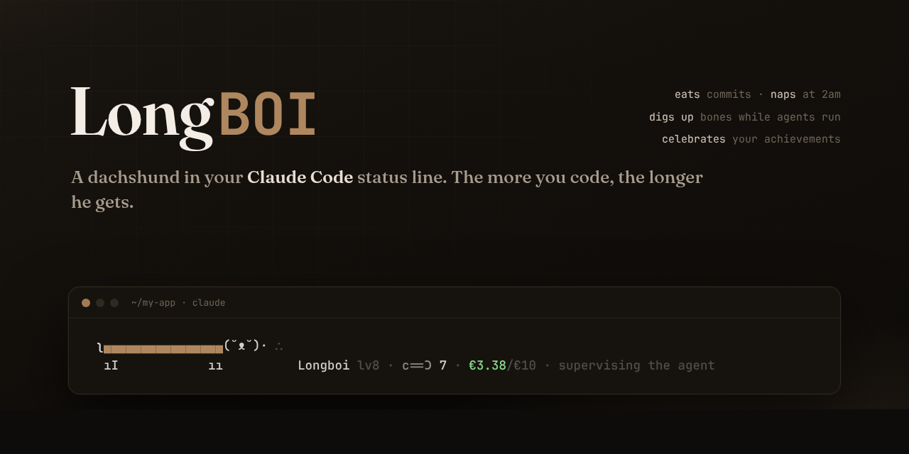
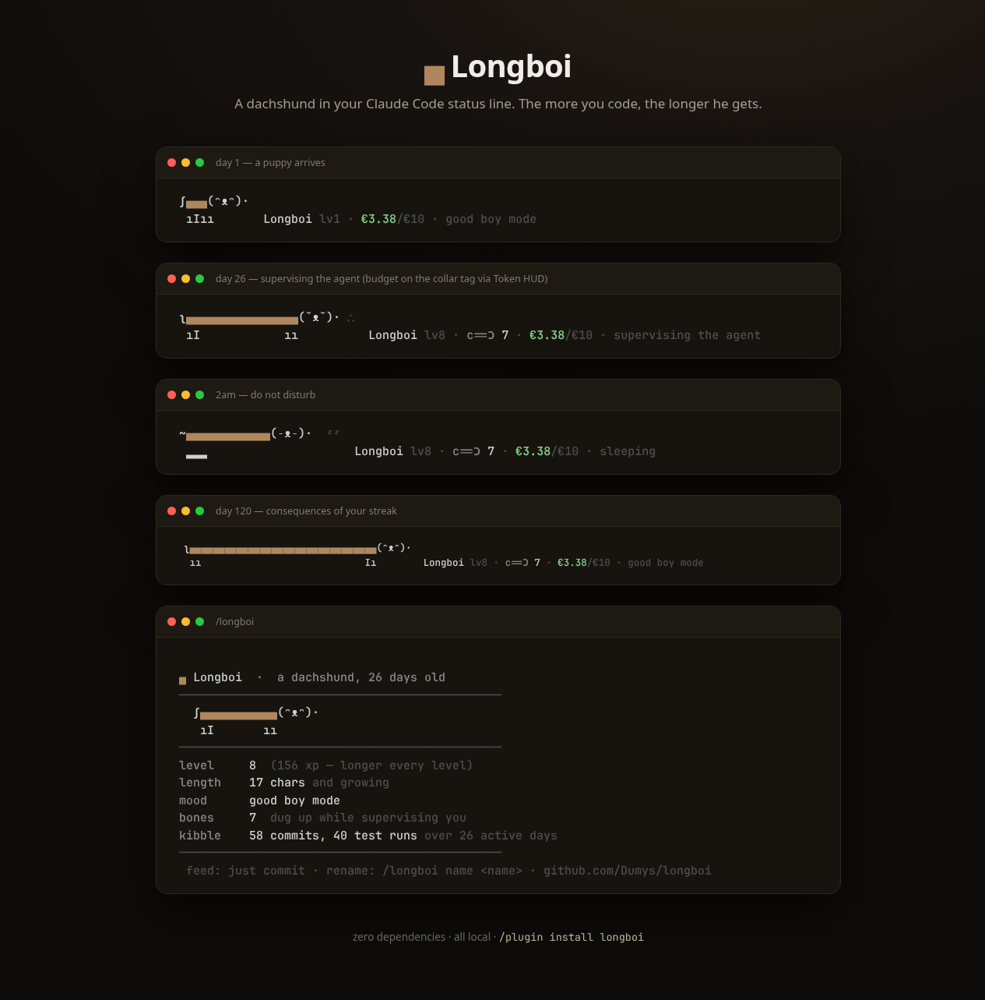

<p align="center">
  
</p>

<p align="center">
  <a href="LICENSE"></a>
  = 16">
  
  
</p>

<h3 align="center">He lives in your status line. He is very long. He is a good boy.</h3>

<p align="center">
  
</p>

**Longboi** is a dachshund for [Claude Code](https://code.claude.com).
He sits under your conversation, supervises the agent, and reacts to
everything that actually happens in your sessions:

- **He grows.** Levels come from real work — active days, commits, test runs.
  Every level makes him one segment longer. A serious streak produces a
  *seriously* long dog.
- **He eats commits.** `git commit` through Claude = kibble. No commits by
  afternoon and he starts thinking about bones (`…c==Ɔ?`).
- **He sleeps at night.** After 2am he curls up (`˗ᴥ˗ ᶻᶻ`). If you are coding
  at that hour, that makes one of you being responsible.
- **He digs.** While agents grind away, he occasionally digs up a bone.
  Bones are forever. Bones are the point.
- **He knows the family.** If [Token HUD](https://github.com/Dumys/token-hud)
  is installed, his collar tag shows today's spend vs budget — and he looks
  *guilty* when you blow it. When [Trophy Case](https://github.com/Dumys/trophy-case)
  unlocks an achievement, he celebrates before you have read the toast.



## Adopt

**As a plugin** (inside Claude Code):

```
/plugin marketplace add Dumys/longboi
/plugin install longboi@longboi
```

then ask Claude to *"put longboi in my status line"* — or run:

```bash
node dog/longboi.js --install     # prints your adoption certificate
```

**Requires:** Node.js ≥ 16, Claude Code ≥ 2.0 (2.1.153+ for width-aware rendering).

## Care manual

| | |
| --- | --- |
| How is he doing? | `/longboi` — or ask Claude *"how's the dog"* |
| Feed him | commit code. That is the food. |
| Extra treat | `node dog/longboi.js --feed` (one per 4 hours; he has a figure to keep) |
| Rename him | `node dog/longboi.js --name Rex` |
| Return him | `node dog/longboi.js --uninstall` (he waits in `~/.claude/longboi`, not mad, just disappointed) |

## How it works

Claude Code re-runs the status line command on every message (and every 2 s
via `refreshInterval` — that is the animation clock). Lightweight
[hooks](https://code.claude.com/docs/en/hooks) record facts — commits, test
runs, failures, activity (~70 ms, after the tool has already finished). The
renderer is stateless: every frame is derived from facts + the clock, so the
dog needs no daemon, no background process, and no network. Ever.

Mood logic, in order of precedence: eating → achievement celebration →
sleeping (night or >30 min idle) → sad (recent failure) → guilty (over
budget) → happy (recent commit / green tests) → working → hungry → chillin'.

Everything lives in `~/.claude/longboi/state.json`. Delete it and a new puppy
moves in.

## The family

Longboi is part of a small suite of Claude Code companions that read each
other's (local) state:

| | |
| --- | --- |
| [**Token HUD**](https://github.com/Dumys/token-hud) | live cost & budget in the status line — feeds Longboi's collar tag |
| [**Trophy Case**](https://github.com/Dumys/trophy-case) | Steam-style achievements + monthly Wrapped — Longboi celebrates the unlocks |
| **Longboi** | the dog |

## FAQ

**Can he die?** No. He is a status line. The worst that happens is he sleeps
and dreams of your unfinished refactor.

**Why a dachshund?** Look at the shape of a status line. Look at the shape of
a dachshund. Some products design themselves.

**Does he slow anything down?** Rendering is ~40 ms of Node on a 2-second
timer; hooks add ~70 ms after a tool finishes. The model is slower than the dog.

**I already use Token HUD as my status line.** Longboi replaces it but wears
the budget on his collar, so you keep the number that matters. Switch back
any time with `node hud/hud.js --install`.

## License

MIT. The dog is free. He was never yours to buy.
